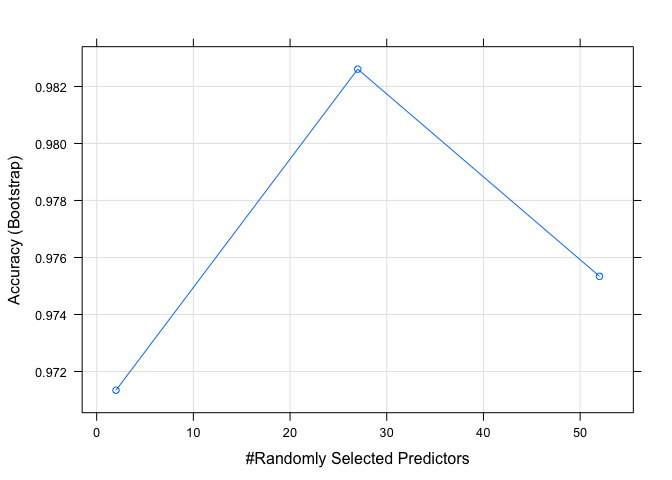

# Practical Machine Learning Final Course Project
Georges Bressange  
10/12/2016  


## 1. Executive summary

Using devices such as Jawbone Up, Nike FuelBand, and Fitbit it is now possible 
to collect a large amount of data about personal activity relatively 
inexpensively. In this project, the goal was to use data from 
accelerometers on the belt, forearm, arm, and dumbell of 6 participants to find 
patterns in the behavior and quantify how well they do these exercises. 

We fit a Random Forest model to predict the outcome **classe**. For this purpose, 
we have not considered the variables with too many miising values. The training set 
has been divided into a smaller training set and a validation set. 

The cross-validation gives an excellent accuracy near 99% and an out-of-sample rate 
inferior to 0.1%.

We finally predict the **classe** outcome on the test set to validate our model. 

## 2. The data: Human Activity Recognition

The data for this project come from this 
[source: ](http://groupware.les.inf.puc-rio.br/har)

Six young health participants were asked to perform one set of 10 repetitions of 
the Unilateral Dumbbell Biceps Curl in five different fashions: exactly 
according to the specification (Class A), throwing the elbows to the front 
(Class B), lifting the dumbbell only halfway (Class C), lowering the dumbbell 
only halfway (Class D) and throwing the hips to the front (Class E).

Class A corresponds to the specified execution of the exercise, while the other 4 classes correspond to common mistakes. Participants were supervised by an experienced weight lifter to make sure the execution complied to the manner they were supposed to simulate. 

[Read more](http://groupware.les.inf.puc-rio.br/har#ixzz4STy1Xr50)

## 3. Downloading and loading the data

The following commands create a local **data** directory if it does not exist and download the files **training.csv** and **testing.csv** in this directory if these files are not already present.


```r
fileUrl1 <- "https://d396qusza40orc.cloudfront.net/predmachlearn/pml-training.csv"
fileUrl2 <- "https://d396qusza40orc.cloudfront.net/predmachlearn/pml-testing.csv"
if(!file.exists("data")){
dir.create("data")
}
if(!file.exists("./data/training.csv")) {
        download.file(fileUrl1,destfile="./data/training.csv",method="curl")
}
if(!file.exists("./data/testing.csv")) {
        download.file(fileUrl2,destfile="./data/testing.csv",method="curl")
}
list.files("./data")
```

```
## [1] "testing.csv"  "training.csv"
```

```r
dateDownloaded <- date()
dateDownloaded
```

```
## [1] "Sun Dec 11 23:39:19 2016"
```

We now import these csv files as data frames.


```r
training <- read.csv("data/training.csv", na.strings = c("NA", ""))
testing <- read.csv("data/testing.csv", na.strings = c("NA", ""))
```

## 4. Description of the variables

The data consist in 19622 observations of 160 variables. The variables 
can be grouped in 10 groups (so far, a detailled codebook cannot be found).

1. The variable **X**: an integer numbering the observations (from 1 to 19622)

2. The variable **user_name** which is a factor variable giving the names of the 
6 participants to this study (Adelmo, Carlitos, Charles, Eurico, Jeremy, Pedro).

3. The two interger variables **raw_timestamp_part_1** and 
**raw_timestamp_part_2**. It seems to correspond to time indexes.

4. The variable **cvtd_timestamp** with indicates the date/time 

5. The variables **new_window** and **num_window** : measurements are done 
during a time window with different lengths from 0.5 to 2.5 seconds with 0.5 overlap. **new_window** indicates the change of window and **num_window** is counting the 
windows.

6. The classe of the performance: classe **A** indicates that the exercise was 
correctly performed and classes **B** to **E** indicate exercices performed with 
common mistakes.

7. 38 variables relative to "belt".


```r
belt_var <- grep("(_belt)", colnames(training))
length(belt_var)
```

```
## [1] 38
```

8. 38 variables relative to "arm".


```r
arm_var <- grep("(_arm)", colnames(training))
length(arm_var)
```

```
## [1] 38
```
9. 38 variables relative to "dumbbell".


```r
dumbbell_var <- grep("(_dumbbell)", colnames(training))
length(dumbbell_var)
```

```
## [1] 38
```
10. 38 variables relative to "forearm".

```r
forearm_var <- grep("(_forearm)", colnames(training))
length(forearm_var)
```

```
## [1] 38
```

## 5. Objective

We would like to fit a model to predict the **classe** variable from the other 
variables as predictors. In other words, we would like to predict how well the 
human has performed the exercise knowing the different measures provided by the 
sensors on his body.

## 6. Cleaning the data

We calculate the percentage of missing values for each variable:


```r
stat_na <- colMeans(is.na(training))
table(round(stat_na,2))
```

```
## 
##    0 0.98 
##   60  100
```

We see that 100 of the 160 variables have near 98% of missing data. We decide to remove these variables.


```r
stat_na <- stat_na[stat_na == 0]
names_na <- names(stat_na)
trainingClean <- subset(training, select = names_na)
dim(trainingClean)
```

```
## [1] 19622    60
```

We also remove the identification variable **X** and **user_name** the which play no role in this modelization.

Moreover, we have not enough information to consider the time variables **raw_timestamp_part_1**, **raw_timestamp_part_2** and **cvtd_timestamp** to use them to build time series. We therefore remove them as well. The **new_window** and **num_window** are not necessary as well.
 
The important fact is to know the association between the intensities of the various quantities measured by the sensors AND the classe of the performance. The other variables retain these associations.
 

```r
library(dplyr)
```

```
## 
## Attaching package: 'dplyr'
```

```
## The following objects are masked from 'package:stats':
## 
##     filter, lag
```

```
## The following objects are masked from 'package:base':
## 
##     intersect, setdiff, setequal, union
```

```r
trainingClean <- select(trainingClean, -c(X, user_name))
trainingClean <- select(trainingClean, -c(raw_timestamp_part_1, raw_timestamp_part_2))
trainingClean <- select(trainingClean, -c(cvtd_timestamp))
trainingClean <- select(trainingClean, -c(new_window, num_window))
dim(trainingClean)
```

```
## [1] 19622    53
```

We finally will use 53 variables: 52 variables as predictors to predict the outcome variable **classe**.

## 7. Fitting a model

We fisrt divide our training set **training** into a smaller training set and a cross-valisation set.


```r
library(caret)
```

```
## Warning: package 'caret' was built under R version 3.3.2
```

```
## Loading required package: lattice
```

```
## Loading required package: ggplot2
```

```
## Warning: package 'ggplot2' was built under R version 3.3.2
```

We set seed to **32333** for reproductibility and create the two subsets:


```r
set.seed(32333)
```


```r
inTrain <- createDataPartition(y = trainingClean$classe, p = 0.7, list = FALSE)
```


```r
trainingClean_train <- trainingClean[inTrain, ]
dim(trainingClean_train)
```

```
## [1] 13737    53
```


```r
trainingClean_valid <- trainingClean[-inTrain, ]
dim(trainingClean_valid)
```

```
## [1] 5885   53
```

We then train a Random Forest model by limiting the number of trees to **10**. 
It has proved to give very good results and have a reasonalble time for the 
calculations. Furthermore, cleaning the dataset by removing variables with 
too many NA's avoided crashes in calculations in the search of the best models. 
We first set a seed for reproductibilty purpose.


```r
set.seed(233)
```


```r
ptm <- proc.time()
modFit <- train(classe ~., data = trainingClean_train, method="rf", ntree = 10, type = "class")
```

```
## Loading required package: randomForest
```

```
## randomForest 4.6-12
```

```
## Type rfNews() to see new features/changes/bug fixes.
```

```
## 
## Attaching package: 'randomForest'
```

```
## The following object is masked from 'package:ggplot2':
## 
##     margin
```

```
## The following object is masked from 'package:dplyr':
## 
##     combine
```

```r
proc.time() - ptm
```

```
##    user  system elapsed 
##  83.148   1.784  85.516
```


```r
plot(modFit)
```

<!-- -->

## 8. Cross-validation

We now want to compute the accuracy of the prediction of our model **modFit**.
We will use the cross-valisation set **trainingClean_valid**. 


```r
pred_valid <- predict(modFit, newdata = trainingClean_valid)
```

The Confusion Matrix of this prediction towards the values of the outcome **classe** in the **trainingClean_valid** set is:


```r
conf_mat_valid <- confusionMatrix(pred_valid, trainingClean_valid$classe)
conf_mat_valid
```

```
## Confusion Matrix and Statistics
## 
##           Reference
## Prediction    A    B    C    D    E
##          A 1672   10    0    0    0
##          B    1 1116    5    1    0
##          C    1    9 1010   13    1
##          D    0    2   11  949    0
##          E    0    2    0    1 1081
## 
## Overall Statistics
##                                           
##                Accuracy : 0.9903          
##                  95% CI : (0.9875, 0.9927)
##     No Information Rate : 0.2845          
##     P-Value [Acc > NIR] : < 2.2e-16       
##                                           
##                   Kappa : 0.9877          
##  Mcnemar's Test P-Value : NA              
## 
## Statistics by Class:
## 
##                      Class: A Class: B Class: C Class: D Class: E
## Sensitivity            0.9988   0.9798   0.9844   0.9844   0.9991
## Specificity            0.9976   0.9985   0.9951   0.9974   0.9994
## Pos Pred Value         0.9941   0.9938   0.9768   0.9865   0.9972
## Neg Pred Value         0.9995   0.9952   0.9967   0.9970   0.9998
## Prevalence             0.2845   0.1935   0.1743   0.1638   0.1839
## Detection Rate         0.2841   0.1896   0.1716   0.1613   0.1837
## Detection Prevalence   0.2858   0.1908   0.1757   0.1635   0.1842
## Balanced Accuracy      0.9982   0.9892   0.9897   0.9909   0.9992
```


```r
CI_acc_low <- round(conf_mat_valid$overall[3],4)
CI_acc_up <- round(conf_mat_valid$overall[4],4)
```

This shows that the 95% confidence interval of the accuracy is 
$[0.9875 , 0.9927 ]$, which is excellent. 

The **out-of-sample error rate** is therefore in the intervalle 
$[0.0125 , 0.0073]$ at a 95% confidence level, and therefore is inferior to 0.02%.

It is interesting to investigate the importance of the variables. 


```r
library(dplyr)
Var_Imp_modFit <- as.data.frame(varImp(modFit)$importance)
Var_Imp_modFit$Overall <- as.numeric(Var_Imp_modFit$Overall)
Var_Imp_modFit <- mutate(Var_Imp_modFit, Variables = rownames(Var_Imp_modFit))
Var_Imp_modFit <- arrange(Var_Imp_modFit, desc(Overall))
head(Var_Imp_modFit)
```

```
##     Overall         Variables
## 1 100.00000         roll_belt
## 2  67.23211     pitch_forearm
## 3  62.27752          yaw_belt
## 4  57.66532        pitch_belt
## 5  55.86960      roll_forearm
## 6  47.52983 magnet_dumbbell_y
```

## 9. Predicting classe on test data

We now predict the outcome **classe** on test data **testing** provided. 
We first perform the same cleaning as we did for **training**.


```r
stat_na <- colMeans(is.na(testing))
stat_na <- stat_na[stat_na == 0]
names_na <- names(stat_na)
testingClean <- subset(testing, select = names_na)
testingClean <- select(testingClean, -c(X, user_name))
testingClean <- select(testingClean, -c(raw_timestamp_part_1, raw_timestamp_part_2))
testingClean <- select(testingClean, -c(cvtd_timestamp))
testingClean <- select(testingClean, -c(new_window, num_window))
dim(testingClean)
```

```
## [1] 20 53
```

We remark that the variable **classe** in the training set corresponds in the test set to the variable **problem_id**.

We now predict the outcome **classe** from the test set by using our model **modFit**.


```r
pred_test <- predict(modFit, newdata = testingClean)
pred_test
```

```
##  [1] B A B A A E D B A A B C B A E E A B B B
## Levels: A B C D E
```


```r
predtest <- as.character(pred_test)
problemid <- testingClean$problem_id
predictions <- as.data.frame(rbind(problemid, predtest))
predictions
```

```
##           V1 V2 V3 V4 V5 V6 V7 V8 V9 V10 V11 V12 V13 V14 V15 V16 V17 V18
## problemid  1  2  3  4  5  6  7  8  9  10  11  12  13  14  15  16  17  18
## predtest   B  A  B  A  A  E  D  B  A   A   B   C   B   A   E   E   A   B
##           V19 V20
## problemid  19  20
## predtest    B   B
```

## 10. Export prediction to a text file

This command creates a one line text file containing the list of the 20 classes


```r
predTest <- as.vector(pred_test)
df <- rbind(predTest)
write.table(df, file = "pred_test.csv", sep = " ", col.names = FALSE, qmethod = "double", row.names=FALSE, quote = FALSE)
```


## 11. Appendix

### Packages used and versions


```r
print(sessionInfo())
```

```
## R version 3.3.1 (2016-06-21)
## Platform: x86_64-apple-darwin13.4.0 (64-bit)
## Running under: OS X 10.11.6 (El Capitan)
## 
## locale:
## [1] fr_FR.UTF-8/fr_FR.UTF-8/fr_FR.UTF-8/C/fr_FR.UTF-8/fr_FR.UTF-8
## 
## attached base packages:
## [1] stats     graphics  grDevices utils     datasets  methods   base     
## 
## other attached packages:
## [1] randomForest_4.6-12 caret_6.0-73        ggplot2_2.2.0      
## [4] lattice_0.20-34     dplyr_0.5.0        
## 
## loaded via a namespace (and not attached):
##  [1] Rcpp_0.12.7        compiler_3.3.1     nloptr_1.0.4      
##  [4] plyr_1.8.4         class_7.3-14       iterators_1.0.8   
##  [7] tools_3.3.1        digest_0.6.10      lme4_1.1-12       
## [10] evaluate_0.10      tibble_1.2         gtable_0.2.0      
## [13] nlme_3.1-128       mgcv_1.8-16        Matrix_1.2-7.1    
## [16] foreach_1.4.3      DBI_0.5-1          yaml_2.1.14       
## [19] parallel_3.3.1     SparseM_1.74       e1071_1.6-7       
## [22] stringr_1.1.0      knitr_1.15         MatrixModels_0.4-1
## [25] stats4_3.3.1       grid_3.3.1         nnet_7.3-12       
## [28] R6_2.2.0           rmarkdown_1.1      minqa_1.2.4       
## [31] reshape2_1.4.2     car_2.1-3          magrittr_1.5      
## [34] scales_0.4.1       codetools_0.2-15   ModelMetrics_1.1.0
## [37] htmltools_0.3.5    MASS_7.3-45        splines_3.3.1     
## [40] assertthat_0.1     pbkrtest_0.4-6     colorspace_1.3-0  
## [43] quantreg_5.29      stringi_1.1.2      lazyeval_0.2.0    
## [46] munsell_0.4.3
```

### References

[source: ](http://groupware.les.inf.puc-rio.br/har)


